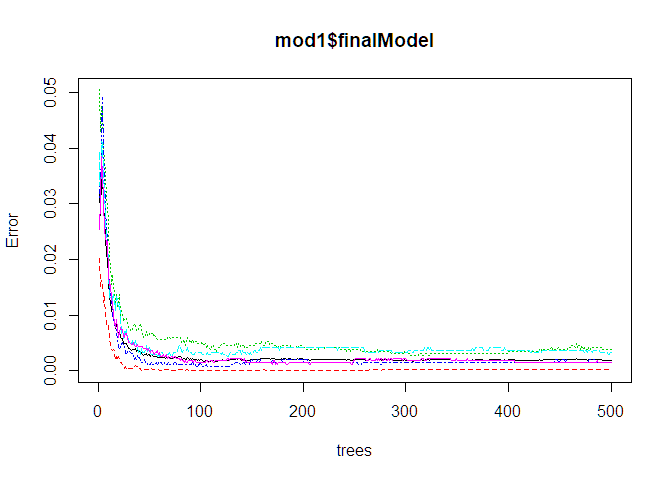
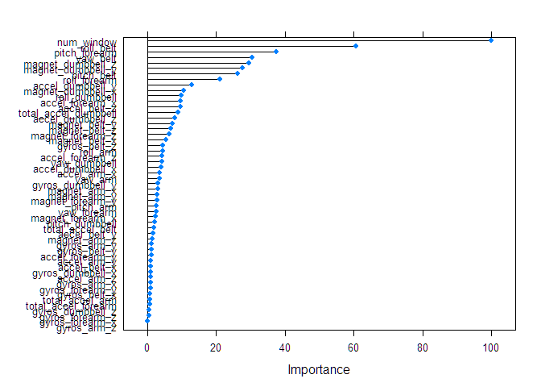

Introduction
------------

Using devices such as Jawbone Up, Nike FuelBand, and Fitbit it is now possible to collect a large amount of data about personal activity relatively inexpensively. These type of devices are part of the quantified self movement - a group of enthusiasts who take measurements about themselves regularly to improve their health, to find patterns in their behavior, or because they are tech geeks. One thing that people regularly do is quantify how much of a particular activity they do, but they rarely quantify how well they do it.

In this project, we will use data from accelerometers on the belt, forearm, arm, and dumbell of 6 participants to predict the manner in which they did the exercise.

Executive Summary
-----------------

Based on a dataset provide by HAR <http://groupware.les.inf.puc-rio.br/har> we will try to train a predictive model to predict what exercise was performed using a dataset with 159 features

Libraries included for analysis

``` r
library(ggplot2)
library(caret)
```

    ## Loading required package: lattice

``` r
library(randomForest)
```

    ## randomForest 4.6-14

    ## Type rfNews() to see new features/changes/bug fixes.

    ## 
    ## Attaching package: 'randomForest'

    ## The following object is masked from 'package:ggplot2':
    ## 
    ##     margin

``` r
library(gbm)
```

    ## Loaded gbm 2.1.5

``` r
library(doParallel)
```

    ## Loading required package: foreach

    ## Loading required package: iterators

    ## Loading required package: parallel

``` r
library(dplyr)
```

    ## 
    ## Attaching package: 'dplyr'

    ## The following object is masked from 'package:randomForest':
    ## 
    ##     combine

    ## The following objects are masked from 'package:stats':
    ## 
    ##     filter, lag

    ## The following objects are masked from 'package:base':
    ## 
    ##     intersect, setdiff, setequal, union

``` r
library(e1071)
trainset <- read.csv("pml-training.csv", head=TRUE, sep=",", na.strings=c("NA","#DIV/0!","")) 
testset <- read.csv("pml-testing.csv", head=TRUE, sep=",", na.strings=c("NA","#DIV/0!",""))  
```

Data Cleanup
------------

Data obtained in the testing and traning set need to be cleaned up, columns contaning a majority of NA values need to be removed, columns with low variance also need to be removed. In the end we should be left with only those coulums wich influence the prediction.

``` r
threshold <- sapply(trainset, function(df) {sum(is.na(df)==TRUE)/length(df)})
thresholdtest <- sapply(testset, function(df) {sum(is.na(df)==TRUE)/length(df)})
traincolidx <-names(which(threshold<0.95))
trainset<-trainset[,traincolidx]
testcolidx  <-names(which(thresholdtest<0.95))
testset<-testset[,testcolidx]
nov1 <- nearZeroVar(trainset,saveMetrics=TRUE)
nov2 <- nearZeroVar(testset,saveMetrics=TRUE)
goodTrainData <- trainset[,which(nov1$nzv==FALSE)]
goodTestData <- testset[,which(nov2$nzv==FALSE)]
RmInx1 <- grepl("X|timestamp|user_name", names(goodTrainData))
goodTrainData <- goodTrainData[, which(RmInx1 ==FALSE)]
RmInx2 <- grepl("X|timestamp|user_name|problem_id", names(goodTestData))
goodTestData <- goodTestData[, which(RmInx2 ==FALSE)]
set.seed(35161)
indexTrain <- createDataPartition (goodTrainData$classe, p=0.75, list=FALSE)
testing <-goodTrainData [- indexTrain,]
inTrain <- createDataPartition(testing$classe, p = 0.75)[[1]]
crossv_test <- testing[ -inTrain,]
training <- goodTrainData [indexTrain ,]
testing<-testing[inTrain,]
```

Training Random Forest
----------------------

We use parallel processing to increase the training speed

``` r
 cl <- makeCluster(detectCores())
 registerDoParallel(cl)
 mod1 <- train(classe ~ ., data=training, method="rf")
 pred1 <- predict(mod1, testing)
 stopCluster(cl)
 plot(mod1$finalModel)
```



Displaying the confusion matrix
-------------------------------

``` r
 confusionMatrix(pred1, testing$classe)
```

    ## Confusion Matrix and Statistics
    ## 
    ##           Reference
    ## Prediction    A    B    C    D    E
    ##          A 1046    2    0    0    0
    ##          B    0  710    2    0    0
    ##          C    0    0  640    2    0
    ##          D    0    0    0  601    3
    ##          E    1    0    0    0  673
    ## 
    ## Overall Statistics
    ##                                          
    ##                Accuracy : 0.9973         
    ##                  95% CI : (0.995, 0.9987)
    ##     No Information Rate : 0.2845         
    ##     P-Value [Acc > NIR] : < 2.2e-16      
    ##                                          
    ##                   Kappa : 0.9966         
    ##                                          
    ##  Mcnemar's Test P-Value : NA             
    ## 
    ## Statistics by Class:
    ## 
    ##                      Class: A Class: B Class: C Class: D Class: E
    ## Sensitivity            0.9990   0.9972   0.9969   0.9967   0.9956
    ## Specificity            0.9992   0.9993   0.9993   0.9990   0.9997
    ## Pos Pred Value         0.9981   0.9972   0.9969   0.9950   0.9985
    ## Neg Pred Value         0.9996   0.9993   0.9993   0.9993   0.9990
    ## Prevalence             0.2845   0.1935   0.1745   0.1639   0.1837
    ## Detection Rate         0.2842   0.1929   0.1739   0.1633   0.1829
    ## Detection Prevalence   0.2848   0.1935   0.1745   0.1641   0.1832
    ## Balanced Accuracy      0.9991   0.9983   0.9981   0.9979   0.9976

The confusion matrix gives and accuracy of 99.69%

Importance of predictors
------------------------

``` r
print(plot(varImp(mod1)))
```



Out of sample error
===================

``` r
pred1 <- predict(mod1,crossv_test)
accuracy <- sum(pred1 == crossv_test$classe) / length(pred1)
accuracy
```

    ## [1] 0.996732

The out of sample Error achieved is 99.67 % with the validation set.

Prediction of new values
------------------------

As a last step in the project, I'll use the validation data sample (pml-testing.csv) to predict a classe for each of the 20 observations based on the other information we know about these observations contained in the validation sample.

``` r
final<- predict(mod1,goodTestData)
 final
```

    ##  [1] B A B A A E D B A A B C B A E E A B B B
    ## Levels: A B C D E
